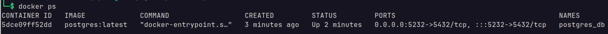

# Untitled API
* * *

### How to run:

- Clone project.
```bash
git clone <project url>
```

  &nbsp;
 
- Go to project foolder.
```bash
cd <project folder>
```


 &nbsp;
 
 - Create virual environment. Command bellow will create environment with your default python version, for other version like `3.10` or `3.11` run command with your version.
 ```bash
 python3 -m venv .venv
 ```
 

 &nbsp;
 
 - Activate virtual environment.
 ```bash
 source .venv/bin/activate
 ```
 
 &nbsp;
 
 - Update pip version (OPTIONAL)
 ```
 pip3 install --upgrade pip
```

&nbsp;

- Install all requirements from `requirements.txt` file.
```bash
pip install -r requirements.txt --upgrade
```

&nbsp;

- Create file `.env` in root folder
```bash
touch .env
```

&nbsp;

- Open `.env` file in your favorite redactor and add next `environments`:

```env
DB_USERNAME=<database_username>
DB_PASSWORD=<secret_password>
DB_HOSTNAME=<database_host>
DB_PORT=<database_port>
DB_NAME=<database_name>
TOKEN_SECRET_KEY=<token_secret_key>
TOKEN_ALGORITHM=<token_algorithm>
TOKEN_EXPIRE_MINUTES=<expire_time_in_minute>
```

Example `.env` file:
```env
DB_USERNAME=postgres
DB_PASSWORD=root
DB_HOSTNAME=localhost
DB_PORT=5432
DB_NAME=kanban_db
TOKEN_SECRET_KEY=dsjghj435ghfghjbmn687gdfhjkhgjkhdfg897456jkhgsdgkh567897dfgh
TOKEN_ALGORITHM=HS256
TOKEN_EXPIRE_MINUTES=60
```

&nbsp;

If you have `PostgreSQL` installed in your local machine just add credentials in `.env` file

If not use docker to create a container with `PostgreSQL` image  run `docker-compose.yml` file.
```bash
docker-compose up -d
```

Make sure container run successfully
```bash
docker ps
```


- Run `uvicorn` server
```bash
uvicorn api.main:app --reload --port=8888
```

FastApi Application runs on [http://localhost:8888](http://localhost:8888)

#### Done
The server will restart automatically when files change
